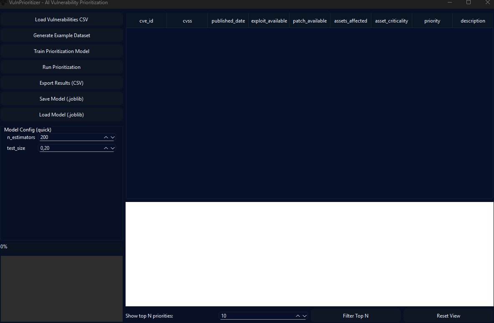

# VulnPrioritizer - AI Vulnerability Prioritization Tool

> **Important:** VulnPrioritizer is an AI-powered vulnerability prioritization tool implemented in Python using PyQt6. It allows security teams to load, analyze, and prioritize vulnerabilities based on synthetic scoring and machine learning models. This README explains setup, running, packaging, and usage instructions.



---

## Table of Contents

1. [Quick Start](#1-quick-start)
2. [What is VulnPrioritizer](#2-what-is-vulnprioritizer)
3. [Running from Source (Recommended)](#3-running-from-source-recommended)
4. [Building a Single-File `.exe` using PyInstaller](#4-building-a-single-file-exe-using-pyinstaller)
5. [Files Included in Build](#5-files-included-in-build)
6. [Runtime Requirements & Optional Features](#6-runtime-requirements--optional-features)
7. [Packaging Tips & Notes](#7-packaging-tips--notes)
8. [Feature Engineering & Labels](#8-feature-engineering--labels)
9. [Using the GUI](#9-using-the-gui)
10. [Troubleshooting](#10-troubleshooting)
11. [Saving & Loading Models](#11-saving--loading-models)
12. [Exporting Results](#12-exporting-results)
13. [Security, Ethics & License](#13-security-ethics--license)
14. [Release Notes & Changelog (v1.0)](#14-release-notes--changelog-v10)
15. [Credits & Acknowledgements](#15-credits--acknowledgements)
16. [FAQ](#16-faq)
17. [Appendix: Useful Commands](#17-appendix-useful-commands)

---

## 1) Quick Start

1. Clone or copy the `VulnPrioritizer` folder into a working directory.
2. Create a virtual environment:

```bash
python -m venv .venv
# Windows
.venv\Scripts\activate
# macOS / Linux
source .venv/bin/activate
Install dependencies:

bash

pip install PyQt6 numpy pandas scikit-learn matplotlib joblib
Run the app:

bash

python VulnPrioritizer.py
The GUI will open with demo features and synthetic dataset support.

2) What is VulnPrioritizer
VulnPrioritizer helps security teams:

Load CSV of vulnerabilities

Generate synthetic datasets

Train a RandomForestRegressor AI model

Prioritize vulnerabilities based on CVSS, exploit availability, asset criticality, patch status, exposure, and time decay

Visualize priority distribution in real-time

Important: Designed for research and internal prioritization only. Do not use for exploitation or attacks.

3) Running from Source (Recommended)
Python 3.9+ is recommended.

Use a virtual environment to isolate dependencies.

Dependencies:

text

PyQt6
numpy
pandas
scikit-learn
matplotlib
joblib
Run with:

bash

python VulnPrioritizer.py
4) Building a Single-File .exe using PyInstaller
Warning: PyQt6 runtime may produce a large .exe.

Example:

bash

pyinstaller --noconfirm --clean --onefile \
  --name VulnPrioritizer \
  --add-data "VulnPrioritizer.py;." \
  --add-data "AI4.ico;." \
  --add-data "ScreenShot.png;." \
  --icon AI4.ico \
  VulnPrioritizer.py
Tips:

Use --onedir to reduce startup delays.

Include .ico and .png explicitly with --add-data.

Exclude unused modules via --exclude-module.

5) Files Included in Build
VulnPrioritizer.py (main)

AI4.ico (application icon)

ScreenShot.png (GUI preview)

Any saved .joblib models

6) Runtime Requirements & Optional Features
Required:

Python 3.9+

PyQt6

numpy, pandas, scikit-learn, matplotlib, joblib

Optional:

Additional Python packages for advanced analytics or preprocessing

Missing optional packages disable extra features gracefully.

7) Packaging Tips & Notes
Expect hundreds of MB for a single-file .exe.

Reduce size via --onedir or excluding unused modules.

Compress icons/assets if needed.

8) Feature Engineering & Labels
Features: cvss, exploit_available, patch_available, assets_affected, asset_criticality, exposure_score, time_decay

Labels generated via synthetic rule-based scoring

Priority scores mapped 0–100 for visualization

9) Using the GUI
Load CSV: Select a CSV file with vulnerabilities

Generate Example Dataset: Creates 120 synthetic vulnerabilities

Train Model: Train AI prioritization model in background

Run Prioritization: Compute priority for all vulnerabilities

Export Results: Save CSV with computed priorities

Save/Load Model: Persist or load .joblib model pipelines

Top N Filter: Quickly display top N vulnerabilities

Reset View: Restore full table view

10) Troubleshooting
Load errors: Ensure CSV has required columns

Training errors: Check Python traceback in log

Prediction errors: Ensure model trained or loaded

UI issues: Verify PyQt6 installation

11) Saving & Loading Models
Save trained RandomForest pipeline via Save Model (.joblib)

Load previously saved models with Load Model (.joblib)

12) Exporting Results
Export full table or filtered top N vulnerabilities to CSV

Requires priority calculation done first

13) Security, Ethics & License
Use internally for vulnerability prioritization only

Do not exploit or distribute vulnerabilities

License: MIT (or repository root)

14) Release Notes & Changelog (v1.0)
v1.0:

Full GUI in PyQt6

RandomForestRegressor pipeline for prioritization

Real-time table updates

Synthetic example dataset generator

Export results and save/load models

Histogram priority visualization

15) Credits & Acknowledgements
Built with Python, PyQt6, scikit-learn, pandas, numpy, matplotlib, and joblib

Inspired by modern AI-assisted vulnerability management tools

16) FAQ
Q: Can I customize the scoring model?
A: Yes, you can retrain using your dataset.

Q: Can I export visualizations?
A: Currently only the histogram plot is in GUI; CSV export contains numeric priorities.

Q: What if I edit table values?
A: Recalculates priority for edited rows in real-time if model is loaded.

17) Appendix: Useful Commands
Run GUI:

bash

python VulnPrioritizer.py
Build .exe:

bash

pyinstaller --noconfirm --clean --onefile \
  --name VulnPrioritizer \
  --add-data "VulnPrioritizer.py;." \
  --add-data "AI4.ico;." \
  --add-data "ScreenShot.png;." \
  --icon AI4.ico \
  VulnPrioritizer.py
Generate Example Dataset in GUI:

Click Generate Example Dataset

Train model

Run prioritization

Export results

End of README